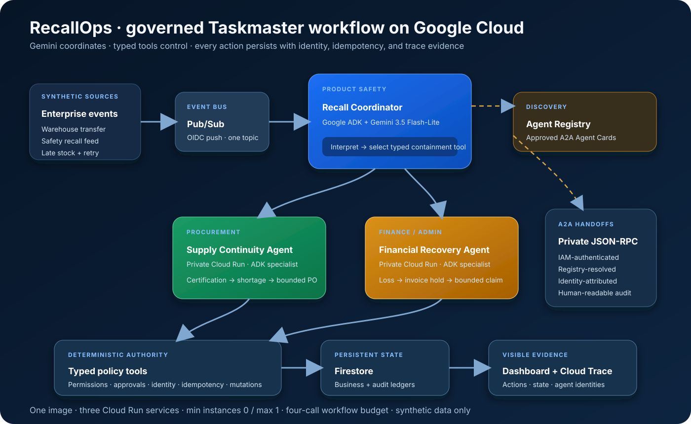

# RecallOps

**A governed AI agent that coordinates an enterprise product recall from containment through
supply recovery and financial recovery.** Built for the **Taskmaster** category of the Google
All Things Agentic Hackathon.

[Open the live Google Cloud control room](https://recallops-recall-sd6ai3qbla-uc.a.run.app)

RecallOps is not a chatbot and the four dashboard buttons are not workflow instructions. They
simulate external warehouse, safety-feed, and Pub/Sub deliveries. After an event arrives,
Google ADK and Gemini interpret and coordinate the response while typed deterministic tools
enforce permissions, business policy, idempotency, approvals, and every state mutation.

## The operational problem

A serious product recall crosses systems and departments immediately. Product Safety must
find exact products, lots, stock, and fulfilled orders. Procurement must prevent a stockout
without buying from an uncertified supplier. Finance must hold related invoices and calculate
contract-backed recovery. Manual handoffs make this slow and difficult to audit.

RecallOps gives each function a specialized, accountable agent:

| Business function | Agent | Autonomous responsibility |
| --- | --- | --- |
| Product Safety | Recall Coordinator | Match the recall, freeze listings, quarantine lots, prepare customer notices |
| Procurement | Supply Continuity | Forecast shortage, disqualify invalid certificates, create a bounded purchase order |
| Finance/Admin | Financial Recovery | Calculate loss, hold linked invoices, create a bounded supplier claim |

Exact matches can proceed autonomously. Ambiguous matches, high-value purchase orders, and
high-value claims stop for approval.

## Live Taskmaster scenario

The public control room exposes four fixed synthetic event deliveries in order:

1. **Inventory transfer:** move 20 units from Chicago to Denver.
2. **Class I recall:** trigger containment plus Registry-discovered Supply and Finance work.
3. **Late recalled inventory:** receive 30 affected units after containment and quarantine
   them immediately.
4. **Duplicate delivery:** redeliver the same Pub/Sub event ID and prove that no second
   mutation occurs.

The deployed scenario produces visible, persistent results: 400 quarantined units, 20
affected customers, one $799 replacement purchase order, a supplier invoice hold, and a
$1,475.24 contract-backed claim.

## Architecture



One container image is deployed as three request-billed Cloud Run services with
`AGENT_ROLE=recall`, `supply`, or `finance`. Minimum instances are `0` and maximum instances
are `1` for every service.

The production sequence is:

1. The dashboard publishes a committed synthetic event to one Pub/Sub topic.
2. An authenticated Pub/Sub push wakes the Recall Coordinator on Cloud Run.
3. Google ADK creates a bounded session and Gemini 3.5 Flash-Lite interprets the recall and
   selects a typed containment tool.
4. The validated tool result determines whether specialist work is required.
5. The coordinator resolves Supply Continuity and Financial Recovery through Agent Registry,
   then calls their private A2A endpoints. Specialist URLs are not orchestration constants.
6. Department-scoped deterministic tools apply mutations to Firestore and emit attributable
   audit events and OpenTelemetry spans to Cloud Trace.
7. The dashboard renders curated business state and human-readable A2A actions without
   exposing customer records, prompts, credentials, or private service URLs.

## Google technology used

| Product | Role in RecallOps |
| --- | --- |
| Gemini 3.5 Flash-Lite on Vertex AI | Recall interpretation and governed tool selection |
| Google Agent Development Kit | Coordinator sessions, typed tools, callbacks, specialist agents |
| Agent Registry | Discovery and caching of approved specialist A2A agents |
| A2A and Agent Cards | Structured private agent-to-agent handoffs |
| Cloud Run | Three scale-to-zero agent services built from one image |
| Pub/Sub | Replayable business-event transport with authenticated push |
| Firestore | Persistent enterprise state, audit records, idempotency ledger, demo ledger |
| Cloud Trace and Cloud Logging | End-to-end workflow, model, tool, and handoff evidence |
| IAM and OIDC | Fixed runtime identities and authenticated service invocation |

## Governance and failure handling

- Models never write directly to Firestore; only validated tools can mutate state.
- The model cannot provide or override the acting agent identity.
- Every mutation has an event ID, idempotency key, fixed actor, reason, outcome, and trace ID.
- Exact GTIN/lot matches proceed; ambiguous matches create approval requests.
- Expired or invalid supplier certification always disqualifies an offer.
- Purchase orders and claims above configured limits require approval.
- A workflow can make at most four model calls; normal recall containment typically uses two.
- Customer notifications use one reviewed template and deterministic merge, not one model call
  per customer.
- Pub/Sub retries are acknowledged safely without repeating business mutations.
- Warm specialist services refresh Firestore before resolving their tool inputs.
- Public controls accept only the committed scenario in order. Raw state, arbitrary events,
  reset, Pub/Sub, OpenAPI, and private A2A routes remain protected.

## Run locally

Local mode is deterministic and credential-free. Python 3.11 or newer is required.

```bash
git clone https://github.com/ahsan3274/recallops.git
cd recallops
python3 -m venv .venv
source .venv/bin/activate
python -m pip install -e ".[dev]"
python scripts/generate_seed.py
uvicorn app.main:app --reload
```

Open <http://127.0.0.1:8000>. Local mode exercises the same policy operations and state
transitions without Google credentials. Run the complete verification suite with:

```bash
python scripts/generate_seed.py
python -m unittest discover -s tests -v
```

Docker is also supported:

```bash
docker compose up --build
```

## Deploy to Google Cloud

These commands create billable resources. Review the scripts and select a billing-enabled
project first. The scripts create one image, three Cloud Run services, one Pub/Sub topic, the
default Firestore database, least-purpose service accounts, Agent Registry entries, and trace
export. They do not create GKE, Cloud SQL, Redis, a vector database, or a VM.

```bash
gcloud auth login
gcloud auth application-default login

export GOOGLE_CLOUD_PROJECT="your-billing-enabled-project"
export CLOUD_RUN_REGION="us-central1"
export GOOGLE_CLOUD_LOCATION="global"
export AGENT_REGISTRY_LOCATION="global"
export IMAGE_TAG="recallops-demo-1"

bash scripts/setup_gcp.sh
bash scripts/deploy_gcp.sh
```

The services are private by default. After testing, expose only the hardened Recall dashboard:

```bash
bash scripts/publish_dashboard.sh
```

Remove anonymous access with:

```bash
bash scripts/unpublish_dashboard.sh
```

Useful verification commands:

```bash
gcloud run services list --region="$CLOUD_RUN_REGION"
gcloud agent-registry agents list \
  --project="$GOOGLE_CLOUD_PROJECT" \
  --location="$AGENT_REGISTRY_LOCATION"
gcloud pubsub subscriptions describe recallops-recall-push
```

## Evaluation coverage

`evals/recallops_cases.json` and the unit suite cover the required policy boundaries:

- normal exact recall containment;
- ambiguous private-label match requiring approval;
- duplicate event suppression;
- late recalled inventory arrival;
- expired supplier certification rejection; and
- approval-required purchase orders and claims.

## Data, privacy, and provenance

The committed demo dataset is generated by `scripts/generate_seed.py` with random seed `42`.
Products, customers, suppliers, warehouses, lots, orders, certifications, contracts, invoices,
and claims in the running scenario are synthetic. Customer email addresses use the reserved
`.invalid` domain. `seed/source_manifest.json` records the generator version and dataset size.

The runtime does not call live public APIs. `scripts/fetch_public_data.py` is an optional,
build-time enrichment utility for USDA FoodData Central and openFDA, but its raw output is
ignored and is **not used by the committed demonstration dataset**. Any future imported
snapshot must include its source, licence, retrieval date, checksum, and transformation
version before it is committed.

## What we learned

- **Reasoning and authority should be separate.** Gemini is useful for interpretation and
  coordination; deterministic policy code is the right place for permissions and mutations.
- **Event retries are normal.** Stable idempotency keys turn duplicate delivery into a safe
  acknowledgement instead of a special failure path.
- **Discovery removes deployment coupling.** Agent Registry lets the coordinator find approved
  specialists without embedding Cloud Run URLs in orchestration configuration.
- **Persistence is not enough by itself.** A warm specialist must refresh shared state before
  resolving inputs changed by another service.
- **Machine-readable agent traffic needs a human view.** A2A JSON-RPC is appropriate between
  services, while judges and operators need a curated, plain-English audit narrative.
- **Lean architecture improves the demo.** Scale-to-zero services, one image, one topic, and a
  bounded model budget make the system easier to reproduce and safer to operate.

## Repository map

```text
agent_cards/   A2A Agent Card templates
app/           FastAPI app, ADK runtime, agents, tools, storage, telemetry, dashboard
assets/        Public architecture evidence
evals/         Deterministic policy evaluation manifest
scenarios/     Replayable synthetic business-event stream
scripts/       Seed, replay, deployment, Registry, and dashboard helpers
seed/          Generated synthetic enterprise state and provenance
tests/         Unit, contract, security, deployment, and end-to-end tests
```

## Cost controls

- Cloud Run request-based billing, minimum `0`, maximum `1` instance per agent.
- Firestore default database and one Pub/Sub topic.
- Gemini Flash-Lite for routine interpretation; Flash reserved for ambiguous work.
- Maximum four model calls per recall workflow and no per-row model calls.
- Public guided runs are rate bounded and expire automatically.
- No GKE, Cloud SQL, Redis, dedicated vector database, or always-on VM.

## Licence

MIT. The committed operational dataset is synthetic and generated by this project.
